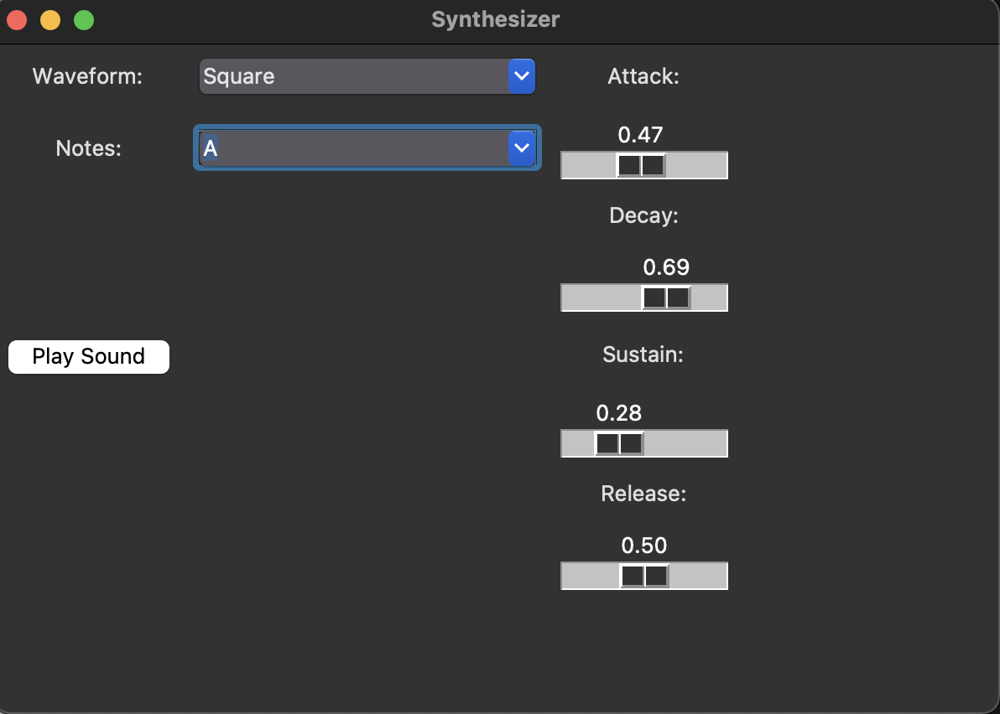

# ECE45 Audio Synthesizer

### Praveen Swaminathan and Aritra Dutta

---

**Contents:**
- Contributors and contributions
- Potential Application of synthesizer
- Basic setup and Usage
- How to use and documentation (screenshots)
- Class material
- Citations

**Contributors:**
1. Praveen Swaminathan: Was in charge of waveform generation (sine, sawtooth, triangle, square) and ADSR envelope classes.

2. Aritra Dutta: Was in charge of GUI layout, and tying waveform and the GUI Layout together for the dropdown menus, button presses, and sliders.

**Setup: Installation**
- ``pip install sounddevice``
- ``pip install tkinter``
- ``pip install numpy``

**Setup: Usage**
- Use the dropdown menus for waveform and sliders for ADSR to have desired settings for sound
- Then, for the notes dropdown menu, choose any note you want in the octave (from middle C to C5)
- Finally, click play to hear the transformed sound
- Below is a labeled picture of the UI

**Potential Application**

The synthesizer that we have made can be modified to make many real world digital noises that represent caution or danger, such as ambulance sirens, fire alarms, tornado warnings, etc. It can also be used simply to make music, like DJ beat drops, or record scratching. 

**Class Material**

In this project, the main highlights are the different types of waveforms a note can be transformed into. In our class, we were able to explore these waveforms mathematically using Fourier series and transforms. For example, with the triangle waves, these can be transformed into square waveforms by taking the derivative of the function. As explored in class, this would result in a new fourier series (continous and repeating signal), with the derivative rule. It would also explain the sound difference we see based on the different waveform settings we select for the notes.

**Citations**

https://www.youtube.com/watch?v=6lETCqsDmOw

https://www.youtube.com/watch?v=Vgp7C5TTsCs

Both of these videos gave insight into how we needed to approach the code of this project, with the oscillations and the ADSR envelope. While these were the main sources for the code in the project, other sources were used for more nuanced issues, with certain bugs in the GUI, and tying modulation and oscillation together. 

